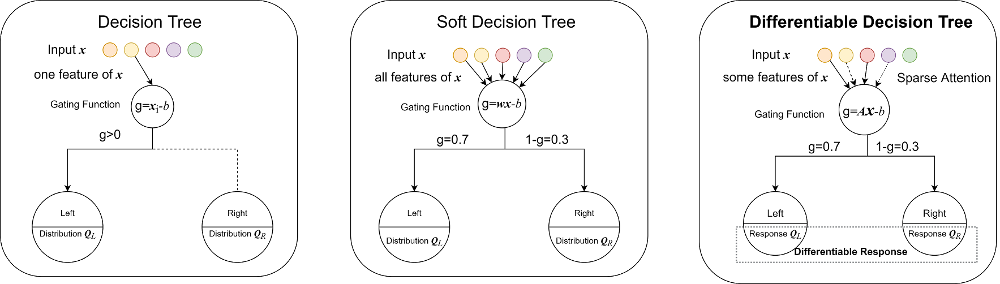

# QuantumForest

QuantumForest is a new lib on the model of differentiable decision trees. It has the advantages of both trees and neural networks. Experiments on large datasets show that QuantumForest has higher accuracy than both deep networks and best GBDT libs(XGBoost, Catboost, mGBDT,...). 

- Keeping **simple tree structure**，easy to use and explain the decision process 

- **Full differentiability** like neural networks. So we could train it with many powerful optimization algorithms (SGD, Adam, …), just like the training of deep CNN.

- Support **batch training** to reduce the memory usage greatly.

- Support the **end-to-end learning** mode. 
Reduce a lot of work on data preprocessing and feature engineering. 
  



  

## Performance

To verify our model and algorithm, we test its performance on **five large datasets**. 

|             | Higgs          | Click          | YearPrediction       | Microsoft    | Yahoo               |
| ----------- | -------------- | -------------- | -------------------- | ------------ | ------------------- |
| Train       | 10.5M          | 800K           | 463K                 | 723K         | 544K                |
| Test        | 500K           | 200K           | 51.6K                | 241K         | 165K                |
| Features    | 28             | 11             | 90                   | 136          | 699                 |
| Problem     | Classification | Classification | Regression           | Regression   | Regression          |
| Description | UCI ML Higgs   | 2012 KDD Cup   | Million Song Dataset | MSLR-WEB 10k | Yahoo LETOR dataset |


The following table  listed the accuracy of some libraries

|               | Higgs     | Click      | YearPrediction | Microsoft  | Yahoo      |
| ------------- | --------- | ---------- | -------------- | ---------- | ---------- |
| CatBoost [7]  | 0.2434    | 0.3438     | 80.68          | 0.5587     | 0.5781     |
| XGBoost [5]   | 0.2600    | 0.3461     | 81.11          | 0.5637     | 0.5756     |
| NODE [2]      | 0.2412    | **0.3309** | 77.43          | 0.5584     | 0.5666     |
| mGBDT [21]    | OOM       | OOM        | 80.67          | OOM        | OOM        |
| QuantumForest | **0.237** | 0.3318     | **74.02**      | **0.5568** | **0.5656** |

*Some results are copied form the testing results of NODE 

 All libraries use default parameters. It’s clear that mGBDT needs much more memory than other libs. mGBDT always failed because out or memory for most large datasets. Both NODE and QuantumForest have higher accuracy than CatBoost and XGBoost. It is a clear sign that differentiable forest model has more potential than classical GBDT models. 


## Demo

python main_tabular_data.py


## Citation

If you find this code useful, please consider citing:

```
[1] Chen, Yingshi. "Deep differentiable forest with sparse attention for the tabular data." arXiv preprint arXiv:2003.00223 (2020).
[2] Chen, Yingshi. "LiteMORT: A memory efficient gradient boosting tree system on adaptive compact distributions." arXiv preprint arXiv:2001.09419 (2020).
```

## Future work

- More huge testing datasets.

  ​	If anyone has larger dataset, please send  to us for testing

- More models.	

- More papers.


## Author

Yingshi Chen (gsp.cys@gmail.com)

